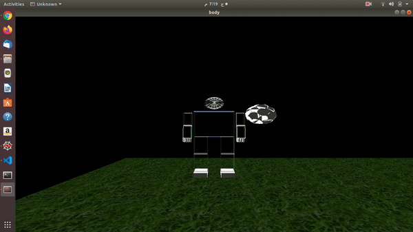
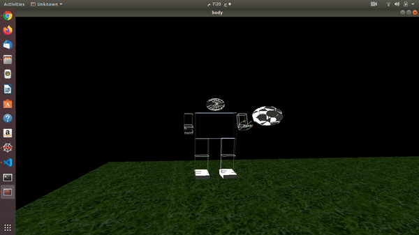

# Computer Graphics_final_project
<!--Headline-->
<!--Image-->
<!--UL-->
<!-- URLs-->
# Team number: 
# Team Members:&nbsp;&nbsp;&nbsp;&nbsp;&nbsp;&nbsp;&nbsp;&nbsp;&nbsp;&nbsp;&nbsp;&nbsp;&nbsp;&nbsp;&nbsp;&nbsp;&nbsp;&nbsp;&nbsp;&nbsp;&nbsp;&nbsp;&nbsp;&nbsp;&nbsp;&nbsp;&nbsp;Sec:&nbsp;&nbsp;&nbsp;&nbsp;&nbsp;ID:     
## Youssef Sameh Mohamed Yasen&nbsp;&nbsp;&nbsp;&nbsp;&nbsp;&nbsp;&nbsp;&nbsp;&nbsp;&nbsp;&nbsp;&nbsp;&nbsp;&nbsp;&nbsp;&nbsp;&nbsp;&nbsp;Sec:2&nbsp;&nbsp;&nbsp;ID:45&nbsp;&nbsp;&nbsp;[E-mail] yossefsameh23@gmail.com

## Omar Ibrahim Mohsen Sayed Ahmed&nbsp;&nbsp;&nbsp;&nbsp;&nbsp;&nbsp;&nbsp;&nbsp;&nbsp;Sec:2&nbsp;&nbsp;&nbsp;ID:10&nbsp;&nbsp;&nbsp;[E-mail] iomar9606@gmail.com 

## Mennatullah Raafat Mohamed Ahmed &nbsp;&nbsp;&nbsp;&nbsp;&nbsp;&nbsp;Sec:2&nbsp;&nbsp;&nbsp;ID:34&nbsp;&nbsp;&nbsp;[E-mail] menna12rere@gmail.com   

## Mustafa Mohamed Tufik Mahmoud&nbsp;&nbsp;&nbsp;&nbsp;&nbsp;&nbsp;&nbsp;&nbsp;&nbsp;&nbsp;&nbsp;&nbsp;Sec:2&nbsp;&nbsp;&nbsp;ID:32;&nbsp;&nbsp;&nbsp;[E-mail] Mostafa.mohamed15397@gmail.com   

## Gehad Mohamed Ahmed Ali Mohamed&nbsp;&nbsp;&nbsp;&nbsp;&nbsp;&nbsp;Sec:1&nbsp;&nbsp;&nbsp;ID:27&nbsp;&nbsp;&nbsp;[E-mail] gehad.mohamed887@gmail.com

# Our Project results:

## The floor and the full body on the top of it with adding the light interaction:

## The floor after putting the texture mapping:

## The object which is added:

## The scene after adding object and texture mapping:
### The scene represents, someone who plays football in a playground.

## First animated motion:
### Someone who walks in an intermediate speed.

## Second animated motion:
### Someone who is doing workouts.

